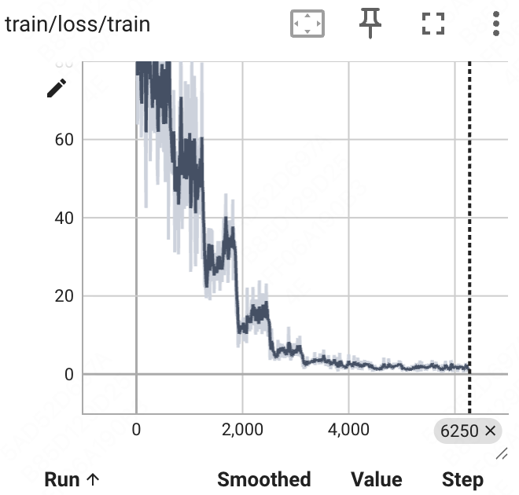

I used the first 10,000 samples from the ```Anthropic/hh-rlhf```([link](https://huggingface.co/datasets/Anthropic/hh-rlhf)) for training to test the correctness of the code.

### Training loss curve

The training loss curve is as follows. We can observe that the loss can converge normally.



